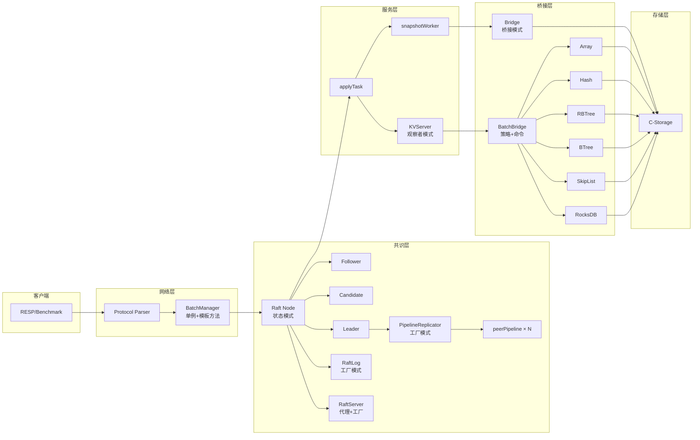

# Raft 分布式存储系统 - 设计模式总结

## 项目概述

本项目是一个基于 **Raft 共识算法** 的分布式 KV 存储系统，采用 **Go + C 混合架构**，支持多种存储引擎（Array、HashTable、RBTree、BTree、SkipList、RocksDB），通过 gRPC 实现节点间通信，RESP 协议对接客户端。

---

## 系统架构图



---

## 设计模式详解

### 1. 状态模式 (State Pattern)

**使用位置**：`src/raft/raft.go`

**解决的问题**：Raft 节点在运行时有三种角色（Follower、Candidate、Leader），每种角色行为不同，需要避免大量的 `if-else` 判断。

**实现代码**：

```go
type Role string

const (
    Follower  Role = "Follower"
    Candidate Role = "Candidate"
    Leader    Role = "Leader"
)

type Raft struct {
    role        Role  // 当前角色状态
    currentTerm int
    votedFor    int
    // ...
}

// 状态转换方法
func (rf *Raft) becomeFollowerLocked(term int)  // 切换为 Follower
func (rf *Raft) becomeCandidateLocked()          // 切换为 Candidate
func (rf *Raft) becomeLeaderLocked()             // 切换为 Leader
```

**状态行为差异**：

| 状态 | 行为特征 |
|------|---------|
| **Follower** | 接收 Leader 心跳，超时后转为 Candidate |
| **Candidate** | 发起选举，收集投票，超时后重新选举或变为 Follower |
| **Leader** | 发送心跳，复制日志，处理客户端读请求 |

**收益**：将不同角色的行为封装在各自的状态逻辑中，代码清晰，状态转换明确，便于维护和扩展。

---

### 2. 工厂模式 (Factory Pattern)

**使用位置**：`src/raft/raft_pipeline.go`、`src/raft/Grpc_Server.go`、`src/raft/raft_log.go`

**解决的问题**：统一复杂对象的创建逻辑，隐藏初始化细节。

**实现代码**：

```go
// PipelineReplicator 工厂
func NewPipelineReplicator(rf *Raft, term int) *PipelineReplicator {
    pr := &PipelineReplicator{
        rf:        rf,
        term:      term,
        pipelines: make([]*peerPipeline, len(rf.peers)),
    }
    for i := range rf.peers {
        if i != rf.me {
            pr.pipelines[i] = newPeerPipeline(i, rf)
        }
    }
    return pr
}

// peerPipeline 工厂
func newPeerPipeline(peer int, rf *Raft) *peerPipeline {
    return &peerPipeline{
        peer:     peer,
        rf:       rf,
        inflight: make([]*pipelineEntry, 0, maxInflight),
        stopCh:   make(chan struct{}),
        cond:     sync.NewCond(&sync.Mutex{}),
    }
}

// RaftLog 工厂
func NewLog(snapLastIdx, snapLastTerm int, snapshot []byte, entries []LogEntry) *RaftLog {
    rl := &RaftLog{
        snapLastIdx:  snapLastIdx,
        snapLastTerm: snapLastTerm,
        snapshot:     snapshot,
    }
    rl.tailLog = make([]LogEntry, 0, 1+len(entries))
    rl.tailLog = append(rl.tailLog, LogEntry{Term: snapLastTerm})
    rl.tailLog = append(rl.tailLog, entries...)
    return rl
}

// gRPC Server 工厂
func NewServer(raftNode *Raft) *RaftServer {
    return &RaftServer{raftNode: raftNode}
}
```

**收益**：集中管理对象创建，便于后续扩展（如新增 Pipeline 策略），隐藏复杂的初始化逻辑。

---

### 3. 单例模式 (Singleton Pattern)

**使用位置**：`src/mnet/batch_manager.go`

**解决的问题**：全局只需要一个 BatchManager 实例，管理全局请求队列和统计状态。

**实现代码**：

```go
var (
    globalBatchManager *BatchManager
    bmMutex            sync.RWMutex
)

func SetBatchManager(bm *BatchManager) {
    bmMutex.Lock()
    defer bmMutex.Unlock()
    globalBatchManager = bm
}

func GetBatchManager() *BatchManager {
    bmMutex.RLock()
    defer bmMutex.RUnlock()
    return globalBatchManager
}
```

**收益**：保证全局唯一实例，使用 `RWMutex` 实现并发安全的读写访问，避免多个实例导致的状态不一致。

---

### 4. 策略模式 (Strategy Pattern)

**使用位置**：`src/bridge/batch_bridge.go`、`src/bridge/batch_ops.c`

**解决的问题**：6 种存储引擎（Array、Hash、RBTree、BTree、SkipList、RocksDB）需要动态选择执行策略。

**实现代码**：

```go
// Go 层：操作类型到存储策略的映射
func ConvertOpsToBatch(raftOps []raft.Op) []BatchOperation {
    for i, op := range raftOps {
        var opType, storageType int
        switch op.OpType {
        case 0:  // Set → Array 策略
            opType = 0; storageType = 0
        case 3:  // HSet → Hash 策略
            opType = 0; storageType = 1
        case 6:  // RSet → RBTree 策略
            opType = 0; storageType = 2
        case 9:  // BSet → BTree 策略
            opType = 0; storageType = 3
        case 12: // ZSet → SkipList 策略
            opType = 0; storageType = 4
        case 15: // RCSet → RocksDB 策略
            opType = 0; storageType = 5
        }
        batchOps[i] = BatchOperation{OpType: opType, StorageType: storageType, ...}
    }
}
```

```c
// C 层：根据 storage_type 选择具体策略
switch (op->storage_type) {
    case 0:  // Array → 调用 set/delete/get
    case 1:  // Hash → 调用 hset/hdelete
    case 2:  // RBTree → 调用 rset/rdelete
    case 3:  // BTree → 调用 bset/bdelete
    case 4:  // SkipList → 调用 zset/zdelete
    case 5:  // RocksDB → 调用 rc_set/rc_delete
}
```

**收益**：新增存储引擎时无需修改现有代码（开闭原则），运行时动态选择策略，代码解耦。

---

### 5. 桥接模式 (Bridge Pattern)

**使用位置**：`src/bridge/bridge.go`

**解决的问题**：Go 层业务逻辑与 C 层存储引擎实现解耦，使两者可以独立演化。

**实现代码**：

```go
// Go 层抽象接口
func Array_Set(key string, klen int, value string, vlen int) string
func Hash_Set(key string, klen int, value string, vlen int) string
func Storage_Snapshot() []byte
func Storage_RestoreSnapshot(snapshot []byte) bool

// CGO 桥接
/*
#cgo CFLAGS: -I./
#cgo LDFLAGS: -L. -lstorage
#include "storage.h"
extern void goLogCallback(char* message, int level);
*/
import "C"

func InitStorage() {
    callback := (C.LogCallback)(unsafe.Pointer(C.goLogCallback))
    C.set_storage_log_callback(callback)
    C.init_array()
    C.init_hashtable()
    C.init_rbtree()
    // ...
}
```

**收益**：
- Go 层可以更换通信协议（如从 RESP 改为 HTTP）而不影响 C 层
- C 层可以优化存储算法而不影响 Go 层
- 两层独立编译、独立测试

---

### 6. 观察者模式 (Observer Pattern)

**使用位置**：`src/server/server.go`

**解决的问题**：客户端提交请求后需要异步等待 Raft 日志提交并应用到状态机，避免阻塞。

**实现代码**：

```go
type KVServer struct {
    notifyChans    map[int]chan []*OpReply  // 索引 → 通知通道（Observer 注册表）
    notifyMu       sync.RWMutex
}

// 注册 Observer
func (kv *KVServer) GetNotifyChannel(index int) chan []*OpReply {
    kv.notifyMu.Lock()
    defer kv.notifyMu.Unlock()
    ch := make(chan []*OpReply, 1)
    kv.notifyChans[index] = ch
    return ch
}

// applyTask 中（Subject 状态变化后通知 Observer）
func (kv *KVServer) applyTask() {
    // ... 处理完 batch 后 ...
    notifyCh := kv.GetNotifyChannel(message.CommandIndex)
    go func(ch chan []*OpReply, replies []*OpReply, idx int) {
        select {
        case ch <- replies:  // 通知等待的 Observer
        case <-time.After(time.Second):
        }
    }(notifyCh, finalReplies, message.CommandIndex)
}
```

**收益**：实现事件驱动的异步通信，提交请求的 goroutine 和日志应用的 goroutine 互不阻塞，提升系统吞吐量。

---

### 7. 命令模式 (Command Pattern)

**使用位置**：`src/raft/raft_replication.go`、`src/server/server.go`

**解决的问题**：将客户端操作封装为对象，支持日志复制、批量处理、事务性执行和回放。

**实现代码**：

```go
// 命令对象
type Op struct {
    Key      string
    Klen     int
    Value    string
    Vlen     int
    OpType   OperationType  // 0=Set, 1=Delete, 2=Count, 3=HSet...
    ClientId int64
    SeqId    int64
}

// 命令队列（一个 LogEntry 包含多个 Op）
type LogEntry struct {
    Term         int
    Command      []Op
    CommandValid bool
    CommandIndex int
}

// 批量命令执行
func BatchApply(ops []BatchOperation) []BatchResult {
    // 封装为 C 层命令并执行
}
```

**收益**：
- 支持命令队列（一个 LogEntry 包含多个 Op）
- 支持命令日志（持久化到磁盘）
- 支持命令回放（通过快照恢复）
- 支持命令撤销（通过快照恢复状态）

---

### 8. 模板方法模式 (Template Method Pattern)

**使用位置**：`src/mnet/batch_manager.go`

**解决的问题**：定义批量处理的标准流程，同时允许在特定步骤进行定制。

**实现代码**：

```go
func (bm *BatchManager) batchWorker() {
    defer bm.wg.Done()
    batch := make([]*BatchRequest, 0, bm.maxBatchSize)
    timer := time.NewTimer(bm.batchTimeout)

    for {
        select {
        case <-bm.stopCh:
            if len(batch) > 0 {
                bm.processBatch(batch)  // 模板方法：处理批次
            }
            return

        case req := <-bm.requestQueue:
            batch = append(batch, req)
            if len(batch) >= int(atomic.LoadInt32(&bm.batchSize)) {
                bm.processBatch(batch)      // 模板方法
                batch = make([]*BatchRequest, 0, bm.maxBatchSize)
                bm.adjustBatchSize()         // 钩子方法：调整批次大小
                timer.Reset(bm.batchTimeout)
            }

        case <-timer.C:
            if len(batch) > 0 {
                bm.processBatch(batch)      // 模板方法
                batch = make([]*BatchRequest, 0, bm.maxBatchSize)
                bm.adjustBatchSize()         // 钩子方法
            }
            timer.Reset(bm.batchTimeout)
        }
    }
}
```

**算法骨架**：
1. 收集请求 → 2. 触发条件判断 → 3. 处理批次（`processBatch`） → 4. 调整参数（`adjustBatchSize`）

**收益**：复用批量处理的标准流程，同时允许在批次大小调整等步骤进行定制（当前是根据延迟自适应调整）。

---

## 设计模式汇总表

| 设计模式 | 文件位置 | 解决的问题 | 带来的收益 |
|---------|---------|-----------|-----------|
| **状态模式** | `raft.go` | Raft 节点角色切换 | 消除复杂条件判断，状态行为清晰 |
| **工厂模式** | `raft_pipeline.go`, `Grpc_Server.go`, `raft_log.go` | 统一对象创建 | 隐藏初始化细节，便于扩展 |
| **单例模式** | `batch_manager.go` | 全局唯一批量处理器 | 保证状态一致性，节省资源 |
| **策略模式** | `batch_bridge.go`, `batch_ops.c` | 多存储引擎动态选择 | 新增引擎无需修改现有代码 |
| **桥接模式** | `bridge.go` | Go 与 C 层解耦 | 两层独立演化，互不依赖 |
| **观察者模式** | `server.go` | 异步通知客户端 | 解耦提交与应用，提升吞吐量 |
| **命令模式** | `raft_replication.go` | 操作封装与日志复制 | 支持批量、事务、回放 |
| **模板方法模式** | `batch_manager.go` | 批量处理流程标准化 | 复用骨架流程，定制特定步骤 |

---

## 额外架构亮点

除了经典设计模式，项目还体现了以下架构设计思想：

### 生产者-消费者模式
- `BatchManager` 的请求队列（`requestQueue`）和解耦的 `batchWorker`

### 代理模式
- `RaftServer` 作为 gRPC 请求的代理，将外部请求转发给内部 Raft 节点

### 享元模式
- `clientSeqTable` 缓存客户端请求结果，避免重复计算

### 门面模式
- `bridge` 包为 C 层存储引擎提供统一的高层接口

---

## 性能优化点

| 优化技术 | 实现位置 | 效果 |
|---------|---------|------|
| **Pipeline 并行复制** | `raft_pipeline.go` | 提升日志复制吞吐 |
| **Leader Lease Read** | `raft.go` | 减少读请求 RTT |
| **自适应 Batch 提交** | `batch_manager.go` | 动态调整批量大小 |
| **分片锁优化** | `batch_bridge.go` | 6 种存储引擎并行执行 |
| **内存池管理** | C 层 | 减少内存分配开销 |
| **Snapshot 压缩** | `raft_log.go` | 控制日志无限增长 |

---

## 技术栈

- **语言**：Go + C（CGO 桥接）
- **通信**：gRPC（节点间）、RESP（客户端）
- **存储引擎**：Array、HashTable、RBTree、BTree、SkipList、RocksDB
- **共识算法**：Raft（Leader Election、Log Replication、Snapshot）
- **协议**：RESP（Redis Serialization Protocol）

---

*生成时间：2026-05-18*
